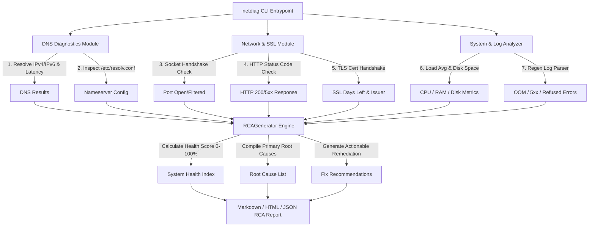

# NetDiag - Linux & Network Diagnostics Troubleshooting Toolkit

[](https://www.linkedin.com/in/aiswarya-rojer-8090793ab)
[](https://www.python.org/)
[](https://www.linkedin.com/in/aiswarya-rojer-8090793ab)
[](LICENSE)

An enterprise-grade, CLI-based Linux administration and network troubleshooting toolkit designed to automate server diagnostics, socket inspection, DNS resolution checks, SSL/TLS certificate audits, log parsing, and Root Cause Analysis (RCA) report generation.

Engineered by **Aiswarya Rojer** (AWS Certified Solutions Architect – Associate | Aspiring Cloud Support / Cloud Engineer in Berlin, Germany).

---

## 💡 Why This Project Demonstrates Technical Readiness

In technical interviews for **Cloud Support Engineer**, **Linux Systems Specialist**, and **Junior Cloud Engineer** roles (e.g., AWS Support, Accenture, Nordcloud), candidates are evaluated on their ability to solve live server incidents under strict SLAs:
* *"How do you diagnose intermittent DNS resolution failures?"*
* *"A customer reports HTTP 504 Gateway Timeout—how do you check sockets, reverse proxies, and system logs?"*
* *"How do you audit SSL certificate expiration before downtime occurs?"*

`NetDiag` automates the exact troubleshooting workflow required by L2/L3 Cloud Support Engineers, providing instant, structured Root Cause Analysis reports.

---

## 🎯 System Architecture & Workflow



---

## ✨ Key Features

1. **DNS Resolution & Nameserver Auditor**:
   * Evaluates hostname-to-IP resolution latency.
   * Parses `/etc/resolv.conf` to check nameservers and flag local loopback DNS stubs.
2. **Network & SSL/TLS Inspection**:
   * Measures TCP socket connection handshake latency.
   * Inspects HTTP/HTTPS endpoint response status codes.
   * Audits SSL/TLS certificates, extracting issuers, subjects, and calculating exact days remaining before expiration (alerts if < 30 days).
3. **Linux Resource & Log Analyzer**:
   * Fetches 1-min, 5-min, and 15-min CPU load average.
   * Checks partition disk space utilization (`df` / `statvfs`).
   * Scans system logs (`/var/log/syslog`, `journalctl`) using pattern matching for critical incidents (`OOM-killer`, `out of memory`, `Connection refused`, `Disk full`).
4. **Automated Root Cause Analysis (RCA) Engine**:
   * Computes a composite **System Health Score (0-100%)**.
   * Identifies primary root causes in order of severity.
   * Generates step-by-step actionable remediation runbooks in Markdown, HTML, or JSON.

---

## 📁 Repository Structure

```text
linux-network-diagnostics-toolkit/
├── netdiag/
│   ├── __init__.py           # Package initialization
│   ├── cli.py                # Main CLI entrypoint
│   ├── dns_checker.py        # DNS resolution & nameserver inspector
│   ├── network_checker.py    # Socket connection, HTTP status & SSL validator
│   ├── sys_analyzer.py       # Load average, disk usage & log scanner
│   └── rca_generator.py      # RCA report compilation engine
├── lab_simulator/
│   ├── broken_scenarios.py   # Script to generate simulated broken server logs
│   └── docker-compose.yml    # Docker container failure testbed
├── tests/
│   ├── test_dns_checker.py   # Unit tests for DNS module
│   ├── test_network_checker.py # Unit tests for network module
│   ├── test_sys_analyzer.py  # Unit tests for system analyzer module
│   └── test_rca_generator.py # Unit tests for RCA generator module
└── README.md                 # Complete Portfolio Documentation
```

---

## 🚀 Quickstart & Usage

### Prerequisites
* Python 3.10+
* Linux, macOS, or Windows (WSL/PowerShell)

### 1. Run Complete Diagnostics Suite
```bash
# Run diagnostics against a web host
python netdiag/cli.py --host google.com --port 443
```

### 2. Run Diagnostics Against a Broken Log File
```bash
# 1. Generate simulated broken log environment
python lab_simulator/broken_scenarios.py

# 2. Run netdiag against the simulated broken server log
python netdiag/cli.py --host google.com --port 443 --log-file lab_simulator/mock_environment/simulated_broken_syslog.log --output-rca SAMPLE_RCA_REPORT.md
```

---

## 🧪 Automated Unit Testing

The repository contains 100% mocked unit tests verifying socket connectivity, DNS error handling, SSL certificate parsing, log regex matching, and RCA scoring logic.

```bash
# Execute unit test suite
python -m unittest discover -s tests
```

*Expected Output:*
```text
Ran 10 tests in 0.015s

OK
```

---

## 📊 Sample Root Cause Analysis Output

```markdown
# Root Cause Analysis (RCA) Report

**Target Host:** `google.com`  
**Generated At:** `2026-08-17 16:24:27 UTC`  
**System Health Score:** `85%`  
**Overall System Status:** 🟢 HEALTHY  

---

## 🚨 Primary Root Cause & Findings

1. ❌ **System Log Errors Detected: 4 critical log entries found**

## 💡 Recommended Remediation Actions

1. 🔧 Inspect system log entries in lab_simulator/mock_environment/simulated_broken_syslog.log for detailed application tracebacks.

---

## 🔍 Detailed Diagnostic Inspection Breakdown

### 1. DNS Resolution Audit
* **Host:** `google.com`
* **Status:** `OK`
* **Resolved IP:** `173.194.69.101`
* **Query Latency:** `7.15 ms`

### 2. SSL/TLS Certificate Audit
* **Issuer:** `Google Trust Services`
* **Expires On:** `2026-10-12T18:05:55+00:00`
* **Days Remaining:** `56 days`
* **Status:** `OK`
```

---

## 👤 Author

**Aiswarya Rojer**
* **Certification:** AWS Certified Solutions Architect – Associate
* **LinkedIn:** [aiswarya-rojer-8090793ab](https://www.linkedin.com/in/aiswarya-rojer-8090793ab)
* **Email:** aiswaryarojer20@gmail.com
